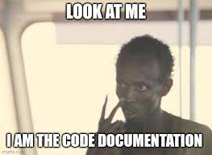
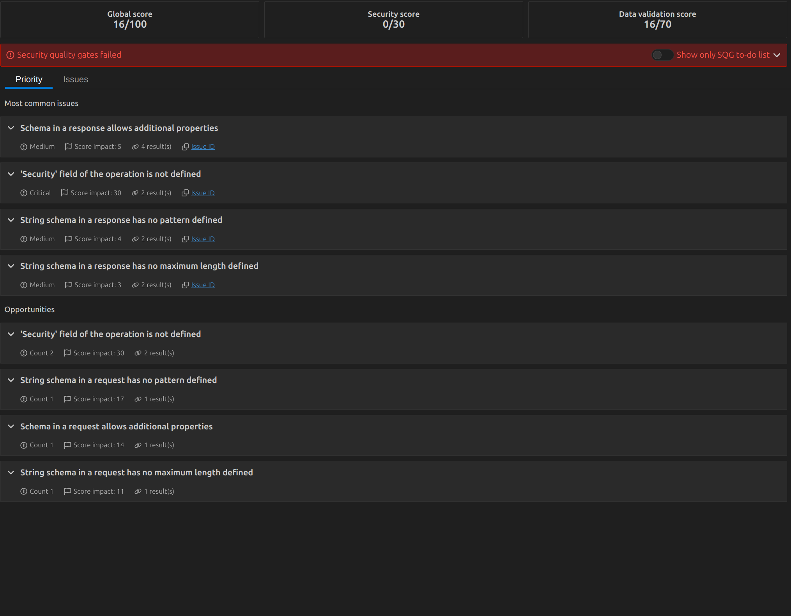
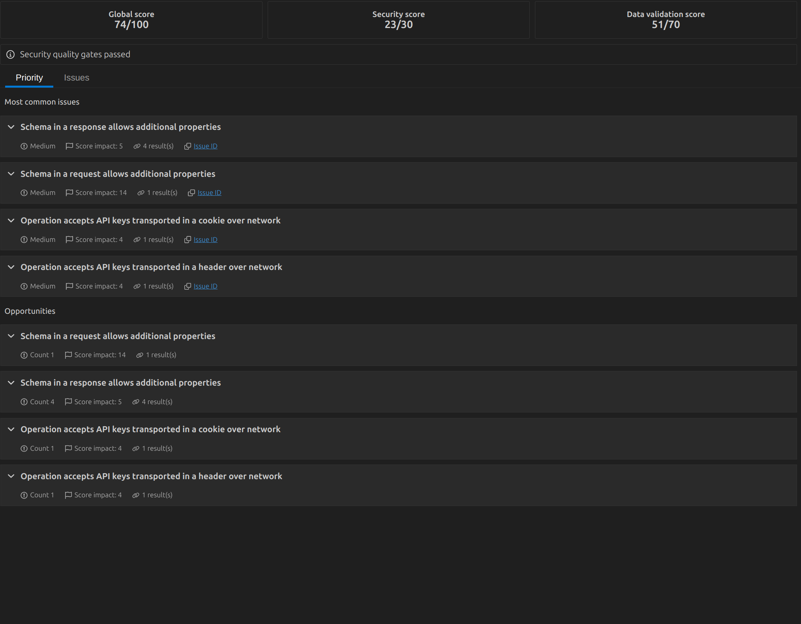

# Audit - Intro

You just arrive in the project and you go see the person in charge of the product to ask where the documentation is, to which he replies : 



After further discussion, he gives you the openAPI file 'petstoreMinimal.json' that hasn't been updated in a while. Anyway this is a good basis for starting to work with the Audit. To your great surprise, it doesn't meet the company's minimum criteria and you take the initiative to solve the problems.
Upon a brief examination, it becomes evident that there are authorization issues and missing constraints related to the Petstore object.

# How to run the Audit

There are two ways to run the Audit:

- Using the 42Crunch UI Platform
    - Go to the https://platform.42crunch.com/ page and login
    - Create a collection in the API Collection page
    - Import an API inside the collection
    - Read the Audit report in the 'Security Audit Report' tab
    - Update the specification and re-run the audit in the 'Security editor tag'
    - More documentation : https://42crunch.com/tutorial-api-security-audit/
- Using the 42Crunch IDE Extension
    - Open your IDE VSCode/IntelliJ
    - Install the 42Crunch extension
        - VSCode (https://marketplace.visualstudio.com/items?itemName=42Crunch.vscode-openapi)
        - IntelliJ (https://plugins.jetbrains.com/plugin/14837-openapi-swagger-editor)
    - Create an IDE token in the page https://platform.42crunch.com/
    - Setup the extension in the IDE
        - VSCode : Ctrl + Shift + P : Update platform credentials
    - Open an OpenAPI Specification file and click on the top right 42Crunch logo



# Improvements

All right, after a short interview with the product guy, you can gather the following information regarding the specification :

Server : 

- For this demo, you can put https in the schema because the API will be executed in production.

```
"servers": [
    {
        "url": "https://localhost:4010"
    }
],
```

FindPetstores: 

- Does not require any authentication

```
 "/petstores": {
    "get": {
        "operationId": "FindPetstores",
        "x-42c-no-authentication": true
        ....
    }
 }
```

CreatePetstore: 

- Requires 'ApiKeyAdmin' or 'CookieAdmin'

```
"/petstores": {
    "post": {
        "operationId": "CreatePetstore",
        "security": [
            {
                "ApiKeyAdmin":[]
            },
            {
                "CookieAdmin":[]
            }
        ],
    }
}
```

Regarding schema objects:

Petstore: 

- Replace minLength/maxLength by minItems/maxItems

```
 "Petstores": {
    "type": "object",
    "required": [
        "items"
    ],
    "properties": {
        "items": {
            "type": "array",
            "items": {
                "$ref": "#/components/schemas/Petstore"
            },
            "minItems": 0,
            "maxItems": 100
        }
    }
},
```

Petname: 

- Add constraint in the json schema:

```
{
    "type": "string",
    "pattern": "^[a-zA-Z]{5,10}$",
    "minLength": 5,
    "maxLength": 10,
    "example": "Petstore"
}

```

Id:

- Add constraint in the json schema:

```
{
    "type": "string",
    "format": "string",
    "pattern": "[a-fA-F0-9]{8}-[a-fA-F0-9]{4}-[a-fA-F0-9]{4}-[a-fA-F0-9]{4}-[a-fA-F0-9]{12}",
    "maxLength": 36,
    "minLength": 36,
    "example": "7fd1b0b3-d0fc-4986-abe8-e92742d42644"
}
                
```

After all theses changes you should see the following score : 



Excellent news! The SQGs have successfully passed, indicating that the file complies with all of the company's security criteria. However, please note that there is still room for enhancement, as the achieved score is not yet at 100%. Please don't hesitate to make any necessary updates to the file.


## Competitors : 

- Spectral
- Shemathesis
- Vaccum 