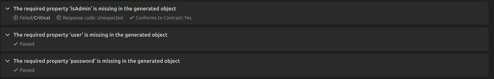
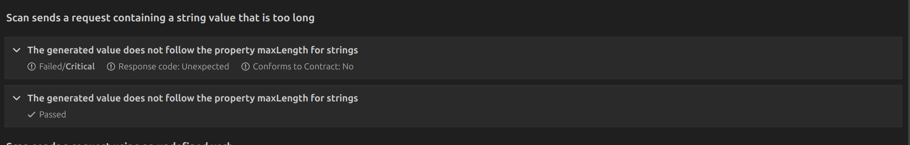
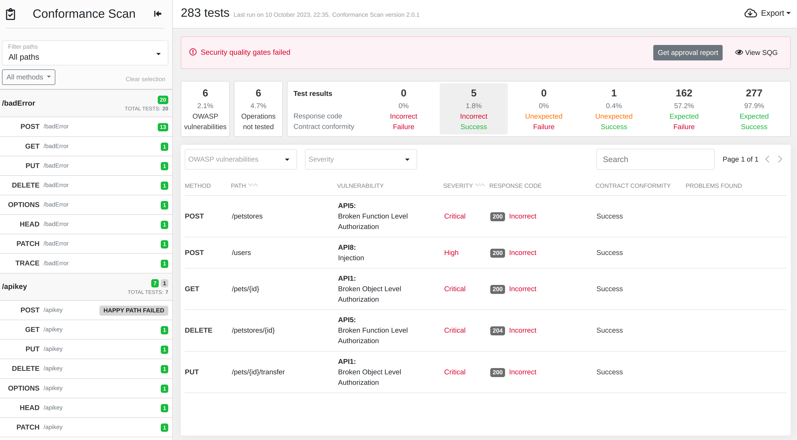

# Scan - Intro

Now it is time to test the actual implementation of the API with the scan ! 


## API Issues

### Authorization

The API has some authorization issues describes below. You can enable/disable them by using the flag --secure

- CreateUser does not verify that the user is an admin
- CreatePetstore does not verify that the user is an admin
- TransferPet does not verify that the user calling the method is the owner of the Pet
- ReadPet does not verify that the user calling the method is the owner of the Pet


### Specification 

To assess the API response's compliance, you need to provide the scanner with an OpenAPI file that deliberately deviates from the specification already integrated into the code. You can use the 'petstoreInvalid.json' file for this purpose.

- In the request of the operation 'CreateUser' the property 'isAdmin' is not required (default "false")
- In the response of the operation 'Version' the property 'version' is a string
- Username max length is 99 instead of 100
- Petname max length is  9 instead of 10


## Using the VSCode Plugin

Using the 42Crunch plugin, you can scan one operation at a time. We will concentrate on the 'CreateUser' operation and identify any flaws.

- Using the 42Crunch IDE Extension
    - Open VSCode/IntelliJ with the 42Crunch extension
    - Update if needed the platform credential with the token
    - Open the file petstoreInvalid.json
    - Hover the operation 'CreateUser' and click on 'Scan', it opens a card in a new tab
    - Please modify the body to utilize random values instead of hardcoded ones. Since the email is unique, the initial request will succeed, but subsequent ones will fail.
        ```
        {
            "isAdmin": false,
            "password": "helloWorld",
            "user": "{{$random}}"
        }
        ```
    - Then in the 'Auth' tabs, set the CookieAdmin or ApiKeyAdmin with the value '65496ebe-6544-4e77-bb66-20b97f6994bb'
    - Click on 'Scan'
    - If everything went fine, you should see the following in the summary page:
        - Test Status : Passed
        - HTTP code received : 200 (Expected: 200)
        - Response code found in API Contract : Yes
        - Response matches API Contract : Yes
    - Navigate to the test panel and investigate any potential issues. You should observe the following two items:
    
    
    - Regarding the maxLength : The reason is the 'maxLength' in the specification is set to 99 and in the implementation 100
        - To resolve the issue : Update the implementation or the specification
    - Regarding the required : The API does not check the presence of the isAdmin property.
        - To address the issue, you can either enforce the check in the API or remove the property from the "required" list.


## Using the Web UI 

Utilizing the UI scan is a more time-consuming process because it involves scanning the entire OpenAPI file. For this workshop, we will use the scan configuration 'configuration.json'
 
- Navigate to the API page you've created during the audit workshop. If you haven't created one yet, use 'petstore.json' located in the parent directory to create a new one.
- Generate a configuration within the 'Conformance Scan' tab.
- Click on 'Add Configuration V2'.
- Provide a name and description for the configuration.
- From the dropdown menu labeled 'Create from,' choose 'Custom Configuration,' and then drag and drop the file named 'configuration.json' from the current directory.
- Run the API in insecure mode.
- Execute the following command using the token obtained from the platform. Don't forget to include the '--network="host"' option if the API is running on your host machine.

    ```
    docker pull 42crunch/scand-agent:v2.0.1
    docker run -e SCAN_TOKEN=<TOKEN> --network="host" 42crunch/scand-agent:v2.0.1
    ```

- Back to the UI: Read the Scan report in the Scan report page
- Filter by Incorrect/Success issues and analyses API problems



## Competitors : 

- StackHawk 
- Cherry Bomb 